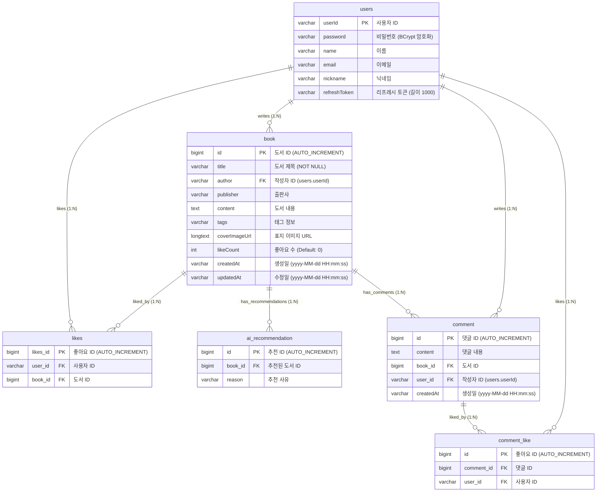

# 도서 관리 시스템 백엔드 (miniproject05)
KT 에이블스쿨 9기 미니프로젝트 5차 백엔드 저장소입니다.  
본 프로젝트는 React 프론트엔드 애플리케이션과 연동하여 동작하는 **Spring Boot 4.0.6 기반의 도서 관리 백엔드 API 서버**입니다. JWT 기반의 사용자 인증 및 마이페이지 프로필 관리, 도서 추천(AI), 그리고 도서/댓글 관련 풍부한 커뮤니티 기능을 제공합니다.

---

## 기술 스택 (Tech Stack)

* **언어 및 런타임**: Java 17
* **프레임워크**: Spring Boot 4.0.6
* **데이터베이스**: H2 Database (로컬 파일 저장 모드: `jdbc:h2:file:~/bookdb`)
* **ORM**: Spring Data JPA & Hibernate
* **보안 및 인증**: Spring Security, JWT (Json Web Token)
* **비밀번호 암호화**: BCrypt (BCryptPasswordEncoder)
* **의존성 & 유틸리티**: Lombok, Spring Boot Validation, RestClient (OpenAI 연동)

---

## 프로젝트 아키텍처 (Layered Architecture)

본 프로젝트는 유지보수성과 관심사 분리를 극대화하기 위해 **계층형 아키텍처(Layered Architecture)**를 채택하고 있습니다.

* **Controller (표현 계층)**: HTTP 요청을 수신하고 엔드포인트를 매핑합니다. DTO와의 상호 변환 및 `@RestControllerAdvice`를 통한 글로벌 예외 제어를 담당합니다.
* **Service (비즈니스 로직 계층)**: 도메인의 흐름을 제어하고 핵심적인 비즈니스 로직을 처리합니다. `@Transactional` 어노테이션으로 DB 트랜잭션의 단위를 설정합니다.
* **Repository (데이터 액세스 계층)**: Spring Data JPA 인터페이스(`JpaRepository`)를 상속하여 DB CRUD 및 검색 쿼리를 처리합니다.
* **Domain (도메인/엔티티 계층)**: JPA 엔티티 정의 및 데이터 무결성을 위한 제약 조건 설정, 영속성 엔티티 객체의 관계 매핑을 구성합니다.
* **Exception (예외 처리 계층)**: 컨트롤러 단에서 발생하는 에러를 캐치하여 사용자 정의 메세지와 일관된 HTTP 상태 코드로 응답하도록 핸들링합니다.

---

## 데이터베이스 모델링 (ERD)

Mermaid로 구성된 관계형 데이터베이스의 엔티티 구조입니다. 사용자(users), 도서(book), 도서 좋아요(likes), AI 추천(ai_recommendation), 댓글(comment) 및 댓글 좋아요(comment_like) 엔티티가 유기적으로 매핑되어 있습니다.



---

## API 명세서 (API Specification)

> **인증 정보 설정**: 인증이 필요한 엔드포인트(`O`)는 반드시 요청 헤더에 `Authorization: Bearer <JWT_ACCESS_TOKEN>` 형식을 포함해야 합니다.

### 1. 사용자 및 인증 API (`/users`)

| HTTP Method | Endpoint | 인증 필요 | 기능 설명 | Request Payload | Response Payload |
| :--- | :--- | :---: | :--- | :--- | :--- |
| **POST** | `/users/register` | X | 신규 회원가입 (비밀번호 BCrypt 암호화 저장) | `{ "userId": "id", "password": "pw", "name": "이름", "email": "이메일", "nickname": "닉네임" }` | **201 Created**<br>`{ "userId": "id", "name": "이름", "email": "이메일", "nickname": "닉네임" }` |
| **POST** | `/users/login` | X | 로그인 (JWT 발급 및 DB Refresh Token 갱신) | `{ "userId": "id", "password": "pw" }` | **200 OK**<br>`{ "accessToken": "...", "refreshToken": "...", "userId": "id", "nickname": "닉네임" }` |
| **POST** | `/users/refresh` | X | Access Token 갱신 | `{ "refreshToken": "..." }` | **200 OK**<br>`{ "accessToken": "..." }` |
| **GET** | `/users/me` | O | 내 프로필 정보 조회 (마이페이지) | 없음 (Authorization 헤더) | **200 OK**<br>`{ "userId": "id", "name": "이름", "email": "이메일", "nickname": "닉네임" }` |
| **PATCH** | `/users/me` | O | 내 프로필 정보 수정 (신규 토큰 재발급) | `{ "nickname": "닉네임", "email": "이메일", "oldPassword": "기존비밀번호", "newPassword": "새비밀번호" }` (모두 선택) | **200 OK**<br>`{ "userId": "id", "name": "이름", "email": "이메일", "nickname": "닉네임", "accessToken": "...", "refreshToken": "..." }` |
| **POST** | `/users/logout` | O | 로그아웃 (DB의 Refresh Token 삭제 및 SecurityContext 즉시 비우기) | 없음 (Authorization 헤더) | **200 OK** (Body 없음) |

### 2. 도서 API (`/books`)

| HTTP Method | Endpoint | 인증 필요 | 기능 설명 | Request Parameters / Payload | Response Payload |
| :--- | :--- | :---: | :--- | :--- | :--- |
| **GET** | `/books` | X | 도서 목록 검색 및 페이징 조회 | **Query String**:<br>- `searchType` (all, title, author, publisher, content, tags, keyword)<br>- `keyWord` (검색어)<br>- `sortBy` (time, 인기순 등 정렬기준)<br>- `order` (asc, desc)<br>- `page` (페이지 번호, 1부터 시작) | **200 OK**<br>`{ "content": [ { "id": 1, "title": "도서명", "author": { "userId": "id", "nickName": "닉네임" }, "publisher": "출판사", "content": "내용", "tags": "태그", "coverImageUrl": "...", "likeCount": 0, "createdAt": "...", "updatedAt": "..." } ], "totalPages": 1, "currentPage": 1 }` |
| **GET** | `/books/{id}` | X | 도서 단건 상세 조회 | 없음 | **200 OK**<br>`{ "id": 1, "title": "도서명", "author": { "userId": "id", "nickName": "닉네임" }, ... }` |
| **GET** | `/books/new` | X | 최신 등록 도서 3권 조회 | 없음 | **200 OK**<br>`[ { "id": 1, "title": "도서명", ... } ]` |
| **GET** | `/books/popular` | X | 인기 도서 3권 조회 | 없음 | **200 OK**<br>`[ { "id": 1, "title": "도서명", ... } ]` |
| **POST** | `/books` | X* | 도서 신규 생성 (Spring Security 허용 상태) | `{ "title": "제목", "author": { "userId": "사용자ID" }, "publisher": "출판사", "content": "내용", "tags": "태그", "coverImageUrl": "..." }` | **201 Created**<br>`{ "id": 1, "title": "도서명", ... }` |
| **PATCH** | `/books/{id}` | O | 도서 부분 수정 (본인 작성 글만 허용) | `{ "title": "수정제목", "publisher": "수정출판사", "content": "수정내용", "tags": "수정태그", "coverImageUrl": "...", "author": { "userId": "사용자ID" } }` (author 필수) | **200 OK**<br>`{ "id": 1, "title": "수정제목", ... }` |
| **DELETE** | `/books/{id}` | O | 도서 삭제 (본인 작성 글만 허용) | 없음 | **204 No Content** (Body 없음) |
| **PATCH** | `/books/{id}/cover` | O | AI 추천 표지 이미지 저장 | `{ "coverImageUrl": "..." }` | **200 OK**<br>`{ "id": 1, "coverImageUrl": "...", ... }` |
| **POST** | `/books/{id}/like` | O | 도서 좋아요 등록 및 취소 토글 | `{ "userId": "사용자ID" }` | **200 OK**<br>`{ "id": 1, "likeCount": 1, ... }` |
| **GET** | `/books/ai-recommendation` | X | 캐시된 AI 이번 달 추천 도서 조회 | 없음 | **200 OK**<br>`{ "id": 1, "title": "도서명", "content": "내용", "author": { "userId": "id", ... }, "publisher": "...", "coverImageUrl": "...", "reason": "AI 추천사유" }` |

### 3. 댓글 API (`/books/{bookId}/comments`)

| HTTP Method | Endpoint | 인증 필요 | 기능 설명 | Request Parameters / Payload | Response Payload |
| :--- | :--- | :---: | :--- | :--- | :--- |
| **GET** | `/books/{bookId}/comments` | X | 해당 도서의 댓글 목록 조회 | **Query String**:<br>- `sort` (likes, createdAt) (기본값: likes) | **200 OK**<br>`[ { "id": 1, "content": "댓글내용", "createdAt": "yyyy-MM-dd HH:mm:ss", "nickname": "닉네임", "userId": "아이디", "likeCount": 0 } ]` |
| **POST** | `/books/{bookId}/comments` | O | 댓글 등록 | `{ "content": "댓글 작성 내용" }` | **200 OK**<br>`"댓글이 성공적으로 등록되었습니다."` |
| **DELETE** | `/books/{bookId}/comments/{commentId}` | O | 댓글 삭제 (본인 작성 글만 허용) | 없음 | **200 OK**<br>`"댓글이 성공적으로 삭제되었습니다."` |
| **POST** | `/books/{bookId}/comments/{commentId}/like` | O | 댓글 좋아요 토글 (해당 댓글 추천/취소) | 없음 | **200 OK**<br>`{ "liked": true, "message": "좋아요를 눌렀습니다." }` <br>또는 `{ "liked": false, "message": "좋아요를 취소했습니다." }` |

---

## 로컬 실행 및 설정 가이드

### 1. 환경 설정 (Configuration)
`src/main/resources/application.yml` 파일에서 데이터베이스 및 JWT, 외부 API 키(AI 추천 연동 시 필수) 설정을 조율합니다.

```yaml
spring:
  datasource:
    driver-class-name: org.h2.Driver
    url: jdbc:h2:file:~/bookdb;  # 로컬 파일 모드 저장
    username: sa
    password: 1234
  h2:
    console:
      enabled: true
      path: /h2-console          # H2 콘솔 접근 경로

jwt:
  secret: aivle-bookapp-jwt-secret-key-2026!
  access-expiration: 10800000    # 3시간 (밀리초)
  refresh-expiration: 86400000   # 24시간 (밀리초)
```

### 2. 의존성 빌드 및 로컬 구동 방법
서버 구동을 완료하면 API 기본 포트는 `8080`으로 실행됩니다.

**Windows 환경 (PowerShell)**:
```powershell
./gradlew.bat bootRun
```


* **API 기본 Endpoint**: `http://localhost:8080`
* **H2 Database Console**: `http://localhost:8080/h2-console`
  - **JDBC URL**: `jdbc:h2:file:~/bookdb`
  - **User Name**: `sa`
  - **Password**: `1234`
